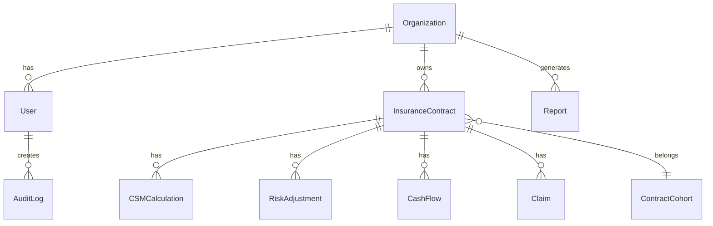

# 🏗️ Architecture Documentation - IFRS 17 Pro

## System Overview

IFRS 17 Pro is a modern, cloud-native SaaS platform built with enterprise-grade architecture following Big Four quality standards.

## Technology Stack

### Frontend
- **Next.js 14**: React framework with App Router
- **TypeScript**: Type-safe development
- **Tailwind CSS**: Utility-first styling
- **Recharts**: Data visualization
- **Lucide Icons**: Modern icon library

### Backend
- **Next.js API Routes**: Serverless API
- **Prisma ORM**: Type-safe database access
- **NextAuth.js**: Authentication
- **Stripe**: Payment processing

### Database
- **PostgreSQL**: Primary data store
- **Multi-tenant**: Organization-level isolation

### Infrastructure
- **Vercel**: Hosting and CDN
- **Edge Functions**: Global low-latency
- **Serverless**: Auto-scaling

## Architecture Principles

### 1. Multi-Tenancy
- Complete data isolation per organization
- Row-level security via `organizationId`
- No shared data between tenants

### 2. Security First
- JWT-based authentication
- RBAC (Role-Based Access Control)
- Audit logging for all mutations
- Encrypted data at rest and in transit

### 3. Scalability
- Serverless architecture
- Connection pooling
- Optimized database queries
- CDN for static assets

### 4. Maintainability
- Type-safe codebase
- Clear separation of concerns
- Comprehensive documentation
- Automated testing

## System Components

### Core Modules

#### 1. Insurance Contract Management
```
src/lib/contracts/
├── validation.ts      # Input validation
├── lifecycle.ts       # Contract lifecycle
└── grouping.ts        # Cohort management
```

#### 2. IFRS 17 Calculation Engine
```
src/lib/ifrs17/
├── csm.ts            # CSM calculations
├── risk-adjustment.ts # Risk quantification
├── cash-flows.ts     # PV calculations
└── measurement.ts    # GMM, PAA, VFA
```

#### 3. Reporting System
```
src/lib/reports/
├── generator.ts      # Report generation
├── exporters/
│   ├── excel.ts     # XLSX export
│   └── pdf.ts       # PDF export
└── templates/       # Report templates
```

#### 4. Authentication & Authorization
```
src/lib/
├── auth.ts          # NextAuth configuration
└── permissions.ts   # RBAC logic
```

## Database Schema

### Core Entities



### Key Tables

#### Organizations
- Multi-tenant root entity
- Subscription management
- Stripe integration

#### Insurance Contracts
- Core business entity
- IFRS 17 classification
- Measurement model selection

#### CSM Calculations
- Roll-forward tracking
- Interest accretion
- Release for service

#### Risk Adjustments
- Multiple risk types
- Confidence levels
- Time series tracking

#### Cash Flows
- Present value calculations
- Discount rate application
- Type classification

#### Audit Logs
- Complete audit trail
- Compliance tracking
- User action history

## API Architecture

### RESTful Endpoints

```
/api/auth/[...nextauth]     # Authentication
/api/contracts              # Contract CRUD
/api/csm/calculate          # CSM calculations
/api/reports/generate       # Report generation
/api/stripe/webhook         # Payment webhooks
```

### Request Flow

```
Client Request
    ↓
Middleware (Auth + RBAC)
    ↓
API Route Handler
    ↓
Business Logic Layer
    ↓
Prisma ORM
    ↓
PostgreSQL Database
    ↓
Response + Audit Log
```

## Security Architecture

### Authentication Flow

```
1. User enters credentials
2. NextAuth validates against DB
3. JWT token generated
4. Token stored in HTTP-only cookie
5. Subsequent requests include token
6. Middleware validates token
7. Session data attached to request
```

### Authorization Layers

1. **Middleware**: Route-level protection
2. **API Routes**: Permission checks
3. **Database**: Row-level security
4. **Business Logic**: Fine-grained control

### Role Hierarchy

```
Admin
  ├── Full system access
  └── User management

Manager
  ├── Contract management
  ├── Report generation
  └── Team oversight

Actuary
  ├── CSM calculations
  ├── Risk adjustments
  └── Technical reports

User
  ├── View contracts
  └── Basic reports

Auditor
  ├── Read-only access
  └── Audit logs
```

## Calculation Engine Architecture

### CSM Calculation Pipeline

```
Input Contract Data
    ↓
Validate Inputs
    ↓
Retrieve Historical Data
    ↓
Calculate Opening Balance
    ↓
Apply Changes (Interest, Releases, etc.)
    ↓
Compute Closing Balance
    ↓
Store Results
    ↓
Trigger Audit Log
    ↓
Return Response
```

### Risk Adjustment Flow

```
Insurance Risk ─┐
Financial Risk ─┤→ Aggregate → Apply Correlation → Total Risk Adjustment
Operational Risk ┘
```

### Cash Flow Projection

```
Contract Terms
    ↓
Generate Cash Flow Timeline
    ↓
Apply Assumptions
    ↓
Discount to Present Value
    ↓
Aggregate by Type
    ↓
Calculate NPV
```

## Reporting Architecture

### Report Generation Pipeline

```
User Request
    ↓
Validate Parameters
    ↓
Query Database
    ↓
Transform Data
    ↓
Apply Template
    ↓
Generate Output (JSON/XLSX/PDF)
    ↓
Store Report Record
    ↓
Return File/URL
```

### Report Types

1. **Balance Sheet**: Assets, liabilities, equity
2. **Income Statement**: Revenue, expenses, net income
3. **CSM Roll-Forward**: Period-over-period changes
4. **Disclosure Notes**: Regulatory disclosures
5. **Analytics**: Custom dashboards

## Performance Optimization

### Database Optimization

- **Indexes**: Strategic indexing on frequently queried fields
- **Connection Pooling**: Reuse database connections
- **Query Optimization**: Efficient Prisma queries
- **Caching**: Redis for frequently accessed data

### Application Optimization

- **Server Components**: Reduce client-side JavaScript
- **Lazy Loading**: Load data on demand
- **Image Optimization**: Next.js Image component
- **Code Splitting**: Automatic by Next.js

### Edge Optimization

- **CDN**: Static assets cached globally
- **Edge Functions**: Low-latency API responses
- **Streaming SSR**: Progressive page rendering

## Monitoring & Observability

### Metrics to Track

1. **Performance**
   - API response times
   - Database query duration
   - Page load times

2. **Business**
   - Active organizations
   - Contract volume
   - Calculation throughput

3. **Errors**
   - Exception rates
   - Failed calculations
   - Authentication errors

### Logging Strategy

```
Application Logs → Vercel Logs
Error Tracking → Sentry
Analytics → Vercel Analytics
Audit Logs → Database
```

## Disaster Recovery

### Backup Strategy

- **Database**: Daily automated backups
- **Code**: Git repository
- **Configuration**: Environment variables in Vercel

### Recovery Procedures

1. **Database Corruption**: Restore from latest backup
2. **Code Issues**: Revert deployment
3. **Data Loss**: Point-in-time recovery
4. **Security Breach**: Rotate credentials, audit logs

## Scaling Strategy

### Horizontal Scaling

- Serverless functions auto-scale
- Stateless architecture
- Connection pooling

### Vertical Scaling

- Database: Increase instance size
- Caching: Add Redis layer
- CDN: Upgrade plan

### Future Considerations

- **Microservices**: Split calculation engine
- **Event-Driven**: Async processing for heavy calculations
- **Read Replicas**: Separate read/write databases
- **Sharding**: Partition by organization

## Deployment Architecture

### Environments

```
Development
    ↓
Staging (preview.vercel.app)
    ↓
Production (ifrs17pro.com)
```

### CI/CD Pipeline

```
Git Push
    ↓
GitHub Actions
    ↓
Run Tests
    ↓
Lint & Type Check
    ↓
Build Application
    ↓
Deploy to Vercel
    ↓
Run Migrations
    ↓
Smoke Tests
    ↓
Go Live
```

## Future Enhancements

### Phase 2
- [ ] Machine learning for claim predictions
- [ ] Real-time collaboration features
- [ ] Mobile applications (iOS/Android)

### Phase 3
- [ ] Multi-language support
- [ ] Advanced scenario analysis
- [ ] Integration marketplace

### Phase 4
- [ ] AI-powered actuarial assistant
- [ ] Blockchain for audit trail
- [ ] Quantum-ready encryption

## Contributing

See [CONTRIBUTING.md](./CONTRIBUTING.md) for guidelines.

## License

Proprietary - All Rights Reserved

---

**Built with excellence for Kazakhstan Insurance Market** 🇰🇿
